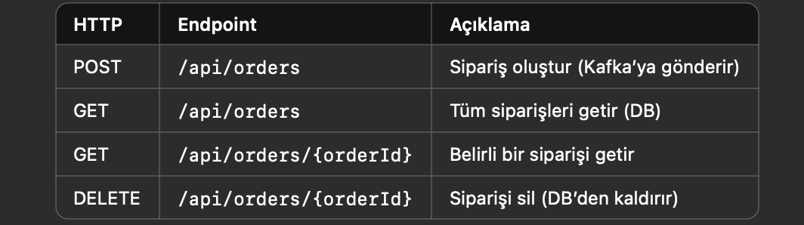

# 🛒 Kafka101 - Event-Driven Order Microservice

Bu proje, Apache Kafka, Spring Boot ve PostgreSQL kullanılarak geliştirilmiş **event-driven** bir mikroservis uygulamasıdır.  
Siparişler REST API üzerinden alınır, Kafka ile kuyruklanır ve arka planda veritabanına kaydedilir.

--- 
### Bizim bu mini projemizin  mimari diyagramini  Chatcpt ile tasarlandi 😎 

___ 

## 📡 Apache Kafka Nedir? Ne Amaçla Kullanılır?

Apache Kafka, sistemler arası veri transferinde yaşanan **protokol uyumsuzlukları**, **veri formatı farkları**, **parse işlemleri** ve **yük yönetimi gibi karmaşık sorunları çözmek için geliştirilmiş** açık kaynaklı, dağıtık bir veri akış (streaming) platformudur.

Tek bir kaynak ve hedef sistem arasında veri aktarımı kolaydır. Ancak birden çok kaynak ve hedef sistem olduğunda, sistemler arası veri entegrasyonu şu zorlukları beraberinde getirir:

- 🔌 Protokol seçimi (TCP, HTTP, FTP, JDBC, REST, SOAP vs.)
- 🧾 Veri formatı (JSON, CSV, XML, Avro, Thrift vs.)
- 🧠 Parse işlemleri
- 💻 Her bir sistem için özel entegrasyon yükü

Bu karmaşayı çözmek için Apache Kafka devreye girer. Kafka sayesinde:

- Sistemler **birbirinden tamamen bağımsız** hale gelir (_loosely-coupled architecture_)
- **Kaynak sistem üzerindeki yük azalır**
- **Gerçek zamanlı veri transferi** sağlanır (genellikle 10ms’den az gecikme ile)

---

## ⚙️ Kafka’nın Temel Özellikleri

- 🏗 **Dağıtık (Distributed)** yapıdadır, yüksek ölçeklenebilirlik sunar
- ♻️ **Hataya dayanıklıdır** (_Fault-Tolerant_)
- 📈 **Yüksek performanslıdır** – saniyede milyonlarca mesaj iletebilir
- ⏱ **Gerçek zamanlı (Real-Time)** veri akışı sağlar
- 📬 **Mesajlaşma altyapısı (Messaging System)** olarak çalışabilir
- 📊 **Etkinlik takibi**, **uygulama loglama**, **stream processing**, **gerçek zamanlı analiz** gibi kullanım alanlarına sahiptir
- 🔗 Özellikle **Big Data** platformlarıyla (Hadoop, Spark, Flink) entegre çalışmak için idealdir

---

## 🧠 Kafka'nın Kökeni

Apache Kafka ilk olarak **LinkedIn** tarafından geliştirilmiş, ardından **Apache Software Foundation** çatısı altında açık kaynaklı hale gelmiştir.  
Günümüzde ise büyük ölçüde **Confluent** firması tarafından aktif olarak bakım ve geliştirmesi yapılmaktadır.
___
## 🚀 Kullanılan Teknolojiler
- ⚙️ Spring Boot 3.4.4
- 🐘 PostgreSQL (Docker üzerinden)
- 📩 Apache Kafka & Zookeeper (Docker üzerinden)
- 💬 Spring Kafka
- 📚 Spring Data JPA
- 📦 Lombok
- 🐳 Docker & Docker Compose
- 📄 Postman (test için)

---

## 📦 Mikroservis Yapısı  


---

## ⚙️ Projeyi Çalıştırmak

### 1. Gerekli Docker servislerini başlat:

```bash
docker-compose up -d 
```
### 🔄 API Endpoint’leri  

  
___ 
### 📤 Örnek Sipariş JSON (POST) 

```aiignore
{
  "orderId": "ORD999",
  "customerEmail": "renas@example.com",
  "totalPrice": 399.99
}

``` 
### POST – Sipariş Oluştur
````aiignore
POST http://localhost:8080/api/orders
```` 
````aiignore
### JSON Body: 
{
  "orderId": "ORD123",
  "customerEmail": "test@example.com",
  "totalPrice": 123.45
}
```` 
````aiignore
### GET – Siparişleri Listele 
GET http://localhost:8080/api/orders
````
````aiignore
### DELETE – Sipariş Sil 
DELETE http://localhost:8080/api/orders/ORD123
```` 
---

## 📚 Kaynakça
- https://www.youtube.com/watch?v=m3GAHcN9aoA&t=5378s
- https://www.youtube.com/watch?v=R4Qbngs_tKw&t=2743s
- [Apache Kafka Resmi Dokümantasyonu](https://kafka.apache.org/documentation/)
- [Spring for Apache Kafka](https://docs.spring.io/spring-kafka/docs/current/reference/html/)
- [Docker Compose Documentation](https://docs.docker.com/compose/)
- Kafka anlatımı için Türkçe referans: "Apache Kafka Nedir?" — yazıdan alıntılanmıştır
- Proje görselleri ve mimari çizim: Bu repo için özel olarak üretilmiştir
- İlham ve mimari model: [Confluent Kafka Tutorials](https://developer.confluent.io/)

---
